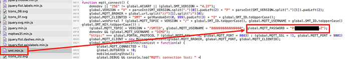

# Home Assistant Remko-MQTT Integration

This integration allows you to control and monitor your Remko heatpump from Home Assistant. 

# Steps to install
1. Configure a MQTT connection within Home Assistant to connect to your heatpump.
   1. The username is "0000000000000000"
   2. The password can be found in the smt.min.js file from the web interface.
   3. 
2. Copy the content from the custom_components folder into Home Assistant and restart Home Assistant.
3. Go to the integrations page and add the Remko-MQTT integration to Home Assistant.
4. Restart Home Assistant another time.

## Debugging
Make sure you see proper mqtt messages from the Remko-MQTT in MQTT-Explorer before setting up HA.
Debug messages are not yet fully implemented.

# Available data
The data available is listed in [REGISTERS.md](https://github.com/Altrec/remko_mqtt-ha/blob/master/REGISTERS.md)

# Features and Limitations
- Currently, provides all data from the heatpump in the form of sensors and binary sensors
- Allows control over the heatpump
- Only works with software versions 4.26+ (earlier version are not yet tested)

# Contributing
Contributions are welcome! If you'd like to contribute, feel free to pick up anything on the current [GitHub issues](https://github.com/Altrec/remko_mqtt-ha/issues) list!
The naming, translation and grouping of registers can be improved, your input is appreciated. Most of it is in the [remko_regs.py](https://github.com/Altrec/remko_mqtt-ha/blob/master/custom_components/remko_mqtt/heatpump/remko_regs.py)  

All help improving the integration is appreciated!

